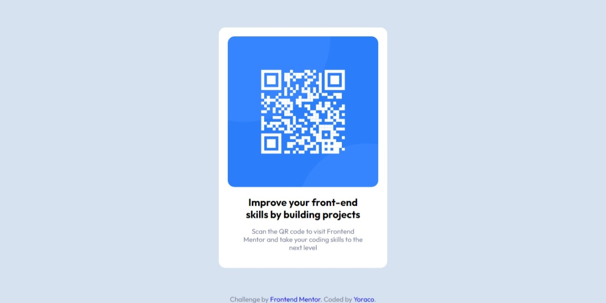

# Frontend Mentor - QR code component solution

This is a solution to the [QR code component challenge on Frontend Mentor](https://www.frontendmentor.io/challenges/qr-code-component-iux_sIO_H). Frontend Mentor challenges help you improve your coding skills by building realistic projects. 

## Table of contents

- [Overview](#overview)
  - [Screenshot](#screenshot)
  - [Links](#links)
- [My process](#my-process)
  - [Built with](#built-with)
- [Author](#author)

## Overview

### Screenshot

### Links

- Solution URL: [Solution](https://www.frontendmentor.io/solutions/httpsmidudevcentrarelementoscss-SJXmP5_S9)
- Live Site URL: [QR-Componet](https://yoraco-qrcomponet.netlify.app/)

## My process

### Built with

- CSS custom properties
- Flexbox
- Mobile-first workflow

## Author

- Website - [Yoraco]
- Frontend Mentor - [@ronnyycl](https://www.frontendmentor.io/profile/ronnyycl)
- Twitter - [@YorakoCode](https://twitter.com/YorakoCode)

